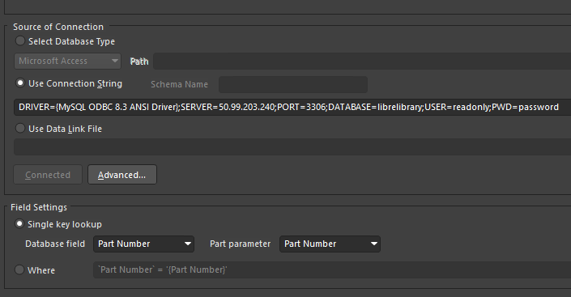
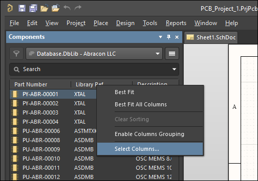
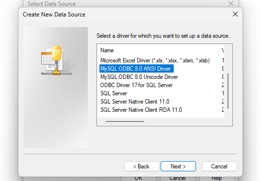
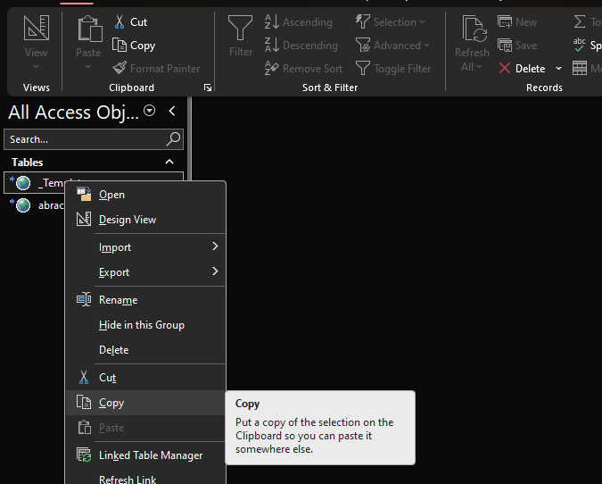
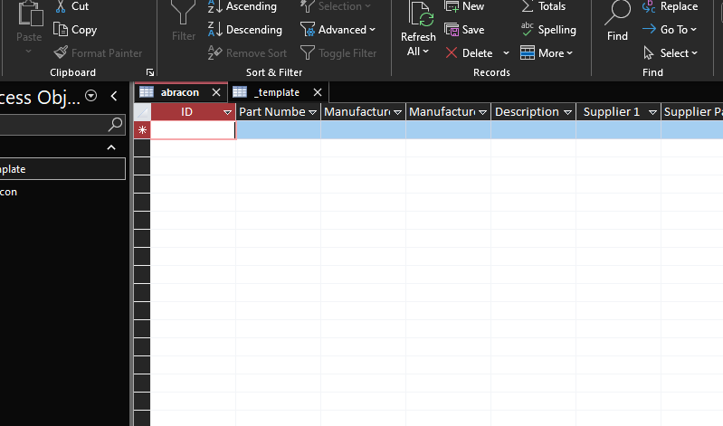
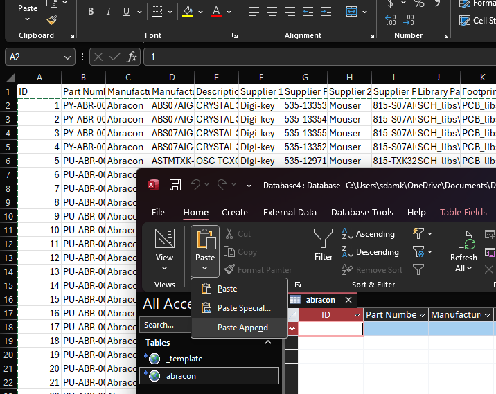

# Libre Library for Altium Designer

Author: Stefan Damkjar (sdamkjar@ualberta.ca)

## Licensing Notice
Copyright: 2024 Stefan Damkjar

The Libre Library project is licensed under the terms of the GNU General Public License as published by the Free Software Foundation, either version 3 of the License, or (at your option) any later version.

The Libre Library project is distributed in the hope that it will be useful, but WITHOUT ANY WARRANTY; without even the implied warranty of MERCHANTABILITY or FITNESS FOR A PARTICULAR PURPOSE. See the GNU General Public License for more details.

The full text of the license can be found here: <https://www.gnu.org/licenses/>.

## Introduction

The purpose of the Libre Library project is to provide a consistant and carefully curated component library for use in PCB projects. The database is stored on a MySQL server and is intended to be used in conjunction with the Altium Designer software. The database contains information about each component such as the manufacturer, part number, and link to the manufacturer's datasheet. The Git repository contains the schematic symbol and PCB footprint for each component.

## Table of Contents

1. [Introductory Altium Tutorials](#header01)
2. [Using the Libre Library](#header02) 
  2.1. [Prerequisites](#header02_01) 
	2.2. [Including the Database in an Altium Project](#header02_02) 
3. [Adding New Content to the Database](#header03) 
  3.1. [Requesting Write Access](#header03_01) 
  3.2. [Connecting to the Database](#header03_02) 
  3.3. [Adding a New Table to the Database](#header03_03) 
  3.4. [Data Entry Guidelines](#header03_04) 

### Appendices

1. [Appendix A - Manufacturer Abbreviations](#headerA) 
2. [Appendix B - Acronyms](#headerB) 

## 1. Introductory Altium Tutorials

The official getting started tutorial published by Altium:

<blockquote style="background-color: rgba(27,31,35,.05);border-radius: 5px;font-size: 100%;margin: 0;padding: 1em 1em; text-align:center;" >	
    <a target="_blank" href="https://www.altium.com/documentation/altium-designer/tutorial-complete-design-walkthrough">https://www.altium.com/documentation/altium-designer/tutorial-complete-design-walkthrough</a>
</blockquote>

A brief (less than 2 hours) video series for Altium Beginners, published by Robert Feranec (a well known creator of Altium Tutorial content):

<blockquote style="background-color: rgba(27,31,35,.05);border-radius: 5px;font-size: 100%;margin: 0;padding: 1em 1em; text-align:center;" >	
    <a target="_blank" href="https://www.youtube.com/watch?v=PqFtSpAXB9Q&list=PLXvLToQzgzdduBaD4horowdWgcG5uGUW4&pp=iAQB">https://www.youtube.com/watch?v=PqFtSpAXB9Q&list=PLXvLToQzgzdduBaD4horowdWgcG5uGUW4&pp=iAQB</a>
</blockquote>

[Back to top...](#headerTop)

## 2. Using the Libre Library

### 2.1. Prerequisites

The `MySQL ODBC 8.x ANSI Driver` **(version 8.0 or later)** is required to connect to the database.

To check if you already have the driver installed, open the `ODBC Data Source` tool by searching for it in the Windows search bar. Click `add` and look for the `MySQL ODBC 8.x ANSI Driver` in the list of drivers. If it is not there, you will need to download and install it.

<i>Fig. 1: Checking for the MySQL ODBC 8.x ANSI Driver</i>

If you do not have the driver installed, you can download it from the MySQL website using the link below. **Make sure to select the 64-bit version when downloading!**

<blockquote style="background-color: rgba(27,31,35,.05);border-radius: 5px;font-size: 100%;margin: 0;padding: 1em 1em; text-align:center;" >	
    <a target="_blank" href="https://dev.mysql.com/downloads/connector/odbc/">https://dev.mysql.com/downloads/connector/odbc/</a>
</blockquote>

### 2.2. Including the Database in an Altium Project

#### 1. Clone the repository

The repository is located at:

<blockquote style="background-color: rgba(27,31,35,.05);border-radius: 5px;font-size: 100%;margin: 0;padding: 1em 1em; text-align:center;" >	
    <a target="_blank" href="https://github.com/sdamkjar/librelib.git">https://github.com/sdamkjar/librelib.git</a>
</blockquote>

The important files and folders in the repository are:

- `PCB_libs` - Contains the PCB footprints for each component
- `SCH_libs` - Contains the schematic symbols for each component
- `librelib.DbLib` - The Altium database library file

#### 2. Include the `librelib.DbLib` in your Altium Project

To include the `librelib.DbLib` file in your Altium project, right click the `.PrjPcb` file in the `Projects` pane in Altium and select `Add Existing to Project...`. Then, navigate to the `librelib.DbLib` file and select it.

<i>Fig. 2: Including the Database in an Altium Project: Select "Add Existing to Project..."</i>

Make sure the connection string in the `librelib.DbLib` file is using the version of the MySQL ODBC driver that you have installed. To do this, open the `librelib.DbLib` file in Altium and look for the `Connection String` field. Refer to [Prerequisites](#header02_01) to see how to check which version of the MySQL ODBC driver you have installed and modify `8.3` to match the version you have installed.

<i>Fig. 3: Including the Database in an Altium Project: Modify the Connection String</i>

Now, the database is included in your Altium project and you should be able to add pieces from it to your Altium schematics. Open or create a schematic (`.SchDoc`) file, and then open the `Components` pane. In Altium 18 and earlier, it is the `Libraries` pane. If you have added the database correctly, you should see a list of component manufacturers in this pane as shown below.

<i>Fig. 4: Using the component database: Choose the .DbLib file</i>

You can show and hide different columns to help search for components by right clicking around the column headers and selecting `Select Columns...` as shown below.

<i>Fig. 5: Using the component database: Choose the .DbLib file</i>

[Back to top...](#headerTop)

## 3. Adding New Content to the Database

### 3.1. Requesting Write Access

To gain write access to the database, you will need to be added as a user in the MySQL server. To request write access, contact the database administrator at `sdamkjar@gmail.com`.

### 3.2. Connecting to the Database

The recommended way to add new components to the database is to set up a Data Source link in `Microsoft Access`. This will allow you to modify the database as spreadsheets.

#### 1. To set up a Data Source link, create a new `Microsoft Access` file and navigate to the `External Data` tab. Click `New Data Source` and select `From Other Sources` and then `ODBC Database`.

<i>Fig. 6: Connecting to the Database: Set up a Data Source link (step 1)</i>

#### 2. Select `Link to the data source by creating a linked table` and click `OK`. Ignore the warning about Adminstrative privileges.

<i>Fig. 7: Connecting to the Database: Set up a Data Source link (step 2)</i>

#### 3. Select `User Data Source` and click `Next`.

#### 4. Select the `MySQL ODBC 8.x ANSI Driver` and click `Next`.

<i>Fig. 8: Connecting to the Database: Set up a Data Source link (step 3)</i>

#### 5. Click finished and then enter the connection details as shown for the MySQL server and click `OK`. User your own username and password. You can test the connection to make sure it is working.

<i>Fig. 9: Connecting to the Database: Set up a Data Source link (step 4)</i>

#### 6. After testing the connection, you should see a list of tables in the database. Select the `librelib` table and click `OK`.

<i>Fig. 10: Connecting to the Database: Set up a Data Source link (step 5)</i>

#### 7. In the `Link Tables` window, choose 'Select All' and click `OK`.

<i>Fig. 11: Connecting to the Database: Set up a Data Source link (step 6)</i>

#### 8. You should now see the tables in the `Tables` pane. You can now open any table and add new components to the database.

[Back to top...](#headerTop)

### 3.3. Adding a New Table to the Database

#### 1. To add a new table to the database, copy and paste the `_Template` table and rename it to the new table name.

<i>Fig. 12: Adding a New Table to the Database: Copy and paste the _Template table</i>

#### 2. Name the new table with the manufacturer name and choose `Linked Table` under `Paste Options`. Click `OK`.

<i>Fig. 13: Adding a New Table to the Database: Name the new table</i>

#### 3. Export the new table to the `librelib` database by right clicking the table and selecting `Export` and then `ODBC Database`.

<i>Fig. 14: Adding a New Table to the Database: Export the new table (Step 1)</i>

#### 4. Keep the table name the same and click `OK`.

<i>Fig. 15: Adding a New Table to the Database: Export the new table (Step 2)</i>

#### 5. Select the `librelib` data source and click `OK`.

<i>Fig. 16: Adding a New Table to the Database: Export the new table (Step 3)</i>

#### 6. To add a new component to the table, open the table and fill in the fields with the component information.

<i>Fig. 17: Adding a New Table to the Database: Add a new component to the table</i>

#### 7. You can copy and paste data from a spreadsheet into the table using the Paste Append feature under the `Home` tab.

<i>Fig. 18: Adding a New Table to the Database: Copy and paste data into the table</i>

[Back to top...](#headerTop)

### 3.4 Data Entry Guidelines

When adding new components to the database, please follow the guidelines below:

#### 1. Part Number

The part number is a unique identifier used by the database to distinguish between different components. The part number should follow the following format:

<blockquote style="background-color: rgba(27,31,35,.05);border-radius: 5px;font-size: 100%;margin: 0;padding: 1em 1em; text-align:center;" >	
    PX-MMM-NNNNN
</blockquote>

  Where:
  - `P` is the indicates that the number refers to a physical part.
  - `X` is the reference designator for the component type. For example, `R` for resistors, `C` for capacitors, `U` for integrated circuits, etc.
  - `MMM` is the manufacturer abbreviation. See [Appendix A](#headerA) for a list of manufacturer abbreviations.
  - `NNNNN` is a unique number that distinguishes the part from other parts of the same type from the same manufacturer.

For example, the part number for a 10k ohm resistor from Vishay would be `PR-VSH-00001`.

[Back to top...](#headerTop)

## Appendix A - Manufacturer Abbreviations

`TODO` Finish creating this list

| Manufacturer                | Abbreviation |
| -------------------------   | ------------ |
| Abracon LLC                 | ABR          |
| Allegro MicroSystems        | AMS          |
| Alliance Memory             | ALM          |
| Alpha Omega                 | AOS          |
| American Technical Ceramics | ATC          |
| Amphenol                    | AMP          |
| Analog Devices              | ADI          |
| Anaren                      | ANA          |
| Asix Electronics            | ASX          |
| AVX Corporation             | AVX          |
| Azurspace                   | AZU          |
| Bourns                      | BRN          |
| Broadcom                    | BCL          |
| BK Precision                | BKP          |
| CK Switches                 | CKS          |
| Cmosis                      | CMO          |
| Coilcraft                   | CCI          |
| Connor Winfield             | CWC          |
| CTS-Frequency Controls      | CTS          |
| CUI                         | CUI          |
| Diodes Incorporated         | DIO          |
| Energy Micro                | EMI          |
| FTDI                        | FTD          |
| Fujitsu                     | FUJ          |
| Grayhill                    | GRH          |
| Hamamatsu                   | HAM          |
| Harwin Incorporated         | HAR          |
| Hillcrest Laboratories      | HCL          |
| Hirose Electric             | HRE          |
| Honeywell                   | HWC          |
| Infineon                    | INF          |
| Intel                       | INT          |
| International Rectifier     | INR          |
| ISSI                        | ISS          |
| IXYS                        | IXY          |
| Johanson Technology Inc     | JTI          |
| JST                         | JST          |
| Kemet                       | KEM          |
| Keystone                    | KSE          |
| Linear Technology           | LTC          |
| Linx Technology Inc         | LNX          |
| Maxim Integrated            | MAX          |
| Memory Protection Devices   | MPD          |
| Microchip                   | MCT          |
| Mill-Max Manufacturing      | MMM          |
| Mini Circuits               | MIN          |
| Molex                       | MLX          |
| Murata                      | MUR          |
| Nanolog                     | NAN          |
| NDK America                 | NDK          |
| Nexperia                    | NEX          |
| NXP Semiconductors          | NXP          |
| Ohmite                      | OHM          |
| ON Semiconductor            | ONS          |
| On Shore Technology         | OST          |
| Orbtronic                   | ORB          |
| Panasonic                   | PAN          |
| Phoenix Contact             | PHC          |
| PUI Audio                   | PUI          |
| Qorvo                       | QOR          |
| Richtek                     | RIC          |
| Riedon                      | RDN          |
| Rohm Semiconductors         | ROH          |
| Samtec                      | SAM          |
| Seiko Instruments           | SKI          |
| SII Semiconductors          | SII          |
| Silicon Labs                | SIL          |
| Silonex                     | SLX          |
| SkyWorks                    | SKW          |
| Sparkfun                    | SPK          |
| Spectrolab                  | SPL          |
| STMicroelectronics          | STM          |
| Sullings                    | SUL          |
| Susumu                      | SUS          |
| Taiyo Yuden                 | TAY          |
| TDK Corporation             | TDK          |
| TE Connectivity             | TEC          |
| Teensy                      | TEE          |
| Toshiba                     | TXS          |
| Trenz Electronic            | TNZ          |
| TT Electronics              | TTE          |
| Vishay                      | VSH          |
| Wurth Elecronics            | WRT          |
| Xilinx                      | XLX          |

## Appendix B - Acronyms

Mouse-over acronyms to see the definition.
